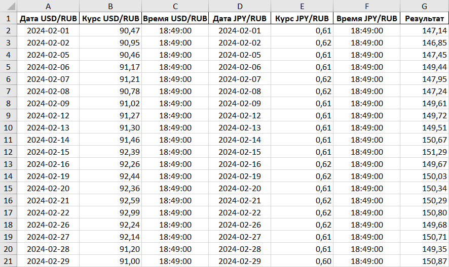

# Finance Xchange Report

Данный мини-проект представляет из себя функционал по загрузке выборочных данных о котировках валют с сайта мосбиржи moex и дальнейшей их обработки.

## Как это работает:

Для получения данных о котировках USD/RUB и JPY/RUB создаются GET запросы. Далее, на базе полученных JSON-файлов создаются датафреймы pandas, после чего формируется итоговая сводная таблица по котировкам в формате Excel-таблицы. Полученный файл автоматически отправляется на почту при помощи протокола SSL.

## Список использованного ПО:
* Python 3.9.13 
* Pandas 1.5.3
* openpyxl 3.1.2
* xlsxwriter 3.2.0
* Microsoft Excel 2016
* ОС - Windows 10 Pro

